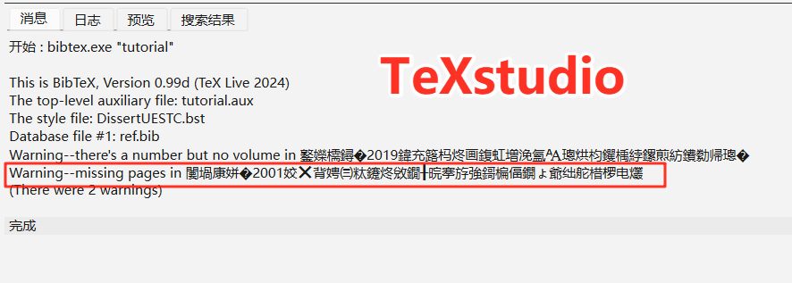
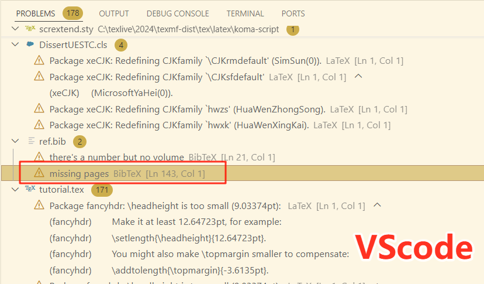

# <center> 电子科技大学学位论文模板2024 </center>

- [ 电子科技大学学位论文模板2024 ](#-电子科技大学学位论文模板2024-)
  - [1. 前言](#1-前言)
    - [1.1 适用对象](#11-适用对象)
    - [1.2 使用环境](#12-使用环境)
    - [1.3 模板完成度](#13-模板完成度)
    - [1.4 模板的更新方法](#14-模板的更新方法)
    - [1.5 开发该模板的原因](#15-开发该模板的原因)
    - [1.6 鸣谢](#16-鸣谢)
  - [2. 导言区](#2-导言区)
  - [3. 论文封面及扉页](#3-论文封面及扉页)
    - [3.1 保密标识（2025.01.07）](#31-保密标识20250107)
    - [3.2 封面](#32-封面)
      - [3.2.1 非“双学位学士”论文封面](#321-非双学位学士论文封面)
      - [3.2.2 “双学位学士”论文封面](#322-双学位学士论文封面)
    - [3.3 中文扉页（仅研究生）](#33-中文扉页仅研究生)
    - [3.4 英文扉页（仅研究生）](#34-英文扉页仅研究生)
  - [4. 独创性声明（仅研究生）](#4-独创性声明仅研究生)
  - [5. 中英文摘要](#5-中英文摘要)
  - [6. 目录、图目录、表目录、主要符号表、缩略词表](#6-目录图目录表目录主要符号表缩略词表)
  - [7. 论文主体部分](#7-论文主体部分)
    - [7.1 写在最前面（2025.01.07）](#71-写在最前面20250107)
    - [7.2 各级标题](#72-各级标题)
    - [7.3 图片](#73-图片)
    - [7.4 表格](#74-表格)
      - [7.4.1 普通表格](#741-普通表格)
      - [7.4.2 带附注表格](#742-带附注表格)
      - [7.4.3 跨页表格](#743-跨页表格)
      - [7.4.4 跨页带附注表格（2025.01.05）](#744-跨页带附注表格20250105)
    - [7.5 伪代码](#75-伪代码)
    - [7.6 定义、公理、定理、命题、推论、引理、示例、假设、证明](#76-定义公理定理命题推论引理示例假设证明)
    - [7.7 脚注](#77-脚注)
    - [7.8 模板中的各种编号](#78-模板中的各种编号)
    - [7.9 在标题中排版数学符号](#79-在标题中排版数学符号)
    - [7.10 引用](#710-引用)
  - [8. 致谢](#8-致谢)
  - [9. 参考文献](#9-参考文献)
  - [10. 附录](#10-附录)
  - [11. 攻读学位期间取得的成果（原则上仅研究生）](#11-攻读学位期间取得的成果原则上仅研究生)
  - [12. 外文资料原文（仅本科生）](#12-外文资料原文仅本科生)
  - [13. 外文资料译文（仅本科生）](#13-外文资料译文仅本科生)


## 1. 前言

### 1.1 适用对象

本模板基于电子科技大学[2024年研究生学位论文撰写规范](https://gr.uestc.edu.cn/xiazai/114/3917)以及通院[关于启动2021级本科毕业设计（论文）工作的通知](https://www.sice.uestc.edu.cn/info/1140/14689.htm)编写，适用于：
- [x] 学术学位博士、专业学位博士:mortar_board:
- [x] 学术学位硕士、专业学位硕士:mortar_board:
- [x] 普通学士、**双学位学士（2025.04.21新增）**:mortar_board:
- [x] **来华留学生International Students（2025.01.07新增）**:mortar_board:

使用本模板的用户需要具备基本的LaTeX排版技能，后续不会对常见命令和环境的使用进行说明。

另外，在本文档以及`tutorial.tex`示例源文件中，明确标注了`仅学士`、`仅研究生`或`仅专业学位`的内容应由对应同学使用，其他同学应该注释或删掉与自己无关的内容。

### 1.2 使用环境

本模板在Windows平台编写，经测试在Overleaf上也能正常工作。**经同学反馈，该模板在Mac端也能正常排版，仅会提示字体相关警告，不影响使用**:clap:。

本地用户需要有LaTeX环境，我的开发和测试环境是TeXLive2024 + TeXstudio，以及TeXLive2024 + VSCode。模板需要使用`XeLaTeX`引擎编译，若各位也使用TeXstudio编辑器，则不需要对软件进行设置：`tutorial.tex`文件首行已经添加了`% !TEX Program = xelatex`，该指令指定使用`XeLaTeX`编译该文档。使用其他编辑器或Overleaf的用户则需要自行将编译引擎设置为`XeLaTeX`。

为了确保使用Windows、MacOS、Overleaf的用户都能顺利完成编译，模板内附了所有用到的字体文件，这导致了项目整体比较大，超过了Overleaf上传压缩包的限制。所以这部分用户只能麻烦一点：:point_right:**先在Overleaf上新建一个文档项目，然后解压本模板并分批拖文件和文件夹到新建的项目中即可**。

:warning: 经部分同学反馈，**<font color=#8b0000>此模板在TeXLive2021上会出现无法按预期渲染封面下划线的情况</font>**，所以请所有本地用户将自己的TeXLive环境更新到[TeXLive2024及以上](https://mirror.bjtu.edu.cn/CTAN/systems/texlive/Images/)。


### 1.3 模板完成度

本模板目前已基本实现了学位论文撰写规范中的要求。但有两处并未实现:sweat_smile:：

- [ ] 未实现将图片中的附注排版在图题之下的功能。原因是并未查找到实现该操作的LaTeX宏包，且个人能力不足，没有实现该功能的思路。替代方法是使用脚注，即通过`\footnotemark`和`\footnotetext`相互配合，细节参见[https://blog.csdn.net/xovee/article/details/127563209](https://blog.csdn.net/xovee/article/details/127563209 "\footnotemark、\footnotetext配合使用")。或者，干脆不要在图中添加附注，改为在文中解释。

- [ ] 伪代码环境无法跨页。本模板排版伪代码使用的宏包是`algorithm2e`，无法跨页排版伪码。注：通常来说，过长的伪码会增加阅读难度，我更建议根据算法逻辑将之拆分成多个子算法或子过程，分别进行排版，最后汇总。

此外，不排除模板存在一些细节上的疏漏。本人尚在撰写学位论文的过程中，如发现或遇到问题仍会修复并更新。请各位使用本模板的同学时常来看看[:point_right:项目发布页](https://github.com/MGG1996/DissertationUESTC)，确保自己处于最新版本:satisfied:。

### 1.4 模板的更新方法

更新模板的正确方式是：:point_right:**下载最新的完整压缩包，解压后用自己的`.bib`和`.tex`文件以及`fig`目录替换掉模板中原有的同名文件和目录**。如果你更改过这两个文件的名称，那直接将之移入最新的模板根目录即可，无需删除目录中的同后缀文件。当然如果你愿意或者有强迫症，删掉模板中提供的`.bib`和`.tex`文件也是可以的。

### 1.5 开发该模板的原因

距离**王稳**学长发布[thesisuestc](https://github.com/bdebye/thesisuestc "王稳成电模板")已经过去几年了，学校的撰写规范时有调整，**我的本意是按照最新的撰写规范设计与之相对应的LaTeX模板，而非复刻[thesisuestc](https://github.com/bdebye/thesisuestc "王稳成电模板")**。在封面页、扉页等部分，旧模板的排布结构大体与新规范一致，但部分页面元素的相对距离、大小等细节却与新规范有不少出入。本模板的目标是毫米级复刻新规范。

另外，本模板希望进一步减少用户的工作量，为此加入了一些人性化功能:gift:。比如：

1. 本模板提供了印刷模式，该模式会根据学校的印刷规范自动在论文前置部分的必要位置插入空白页，无需用户人为处理编译后的文档，完全避免出错。PS：如果你是[thesisuestc](https://github.com/bdebye/thesisuestc "王稳成电模板")用户，切记在需要印刷时用第三方工具（如Adobe Acrobat）去插入空白页，不要尝试在`.tex`源文件中使用`\newpage`+`\thispagestyle{empty}`的组合来生成空白页。上述操作生成的空白页实际上仍然占用了一个页码编号，只是不显示了而已，这会导致后续页码不连续，并不符合规范的要求。而且，相信我，我翻了教研室三本打印装订的学位论文，涵盖博士和硕士，没有一个正确处理了这个问题。

2. 本模板提供了评审模式。此模式在排版封面及中英文扉页时，会隐去所有能确定个人身份的信息，包括导师信息以及独创性声明中的签名和日期。论文送审时，用户不再需要逐个修改相应参数为空。

3. 本模板对`algorithm`环境进行了调整。规范中本身并未说明应该如何排版伪代码，[thesisuestc](https://github.com/bdebye/thesisuestc "王稳成电模板")将伪码环境设置成了两侧边框、字体大小与正文一致、行宽与正文一致的样式，但本人更喜欢期刊模板中的伪代码样式。本模板参考规范中对表格的要求，基于`algorithm2e`宏包设计伪码样式，默认去掉了伪码两侧的框线（当然如果你喜欢，也可以在载入文档类时使用`boxruled`选项或直接在`.cls`文件中找到`algorithm2e`宏包并编辑其选项），字体大小与表格保持一致，并去掉了伪码段首的悬挂缩进。本模板还基于调整后的`algorithm`环境封装了`algo`环境，它允许用户调整伪码浮动体到文本左右侧边界的总缩进距离，默认为4em（即两侧各缩进2字符），与后续段首缩进保持一致。此外，本模板还为伪码定义了`do while`和`loop`循环结构。相关细节参见`tutorial.tex`文档。

4. 本模板提供了便捷生成形如`(1-1a)`的子公式编号的命令。该需求往往出现在数学模型的约束中，最常用的方式可能是使用`\tag{}`命令显示指定某条约束的编号。但是，该方式操作繁琐，而且在后续需要调整约束顺序或增删约束时很容易漏改某些tag导致子公式编号混乱，对论文作者来说这是很容易被忽略的问题。本模板提供的`\subeqtag[<子公式编号标签>]`命令完全避免了这些问题。您只需要在对应的约束后使用`\subeqtag`，该约束就会被赋予与当前主公式编号保持一致的次级编号。并且，对连续的多个约束使用该命令会**自动生成**递增的子公式编号，交换约束顺序编号也会自行更正，断不可能出错。如果您需要在正文中引用某个子公式编号，那么可以像往常一样在`\subeqtag`之后使用`\label{<编号标签>}`，或者直接指定`\subeqtag[<子公式编号标签>]`的可选参数，非常人性化。

5. 本模板优化了`.bst`文件的处理逻辑，它生成参考文献列表时会自行获取文献编号的最大长度，从而调整参考文献条目的悬挂缩进距离，防止产生错落的文献内容左边界。该过程完全不需要人为干预，用户原封不动地使用`\bibliographystyle{<参考文献风格文件>}`+`\bibliography{<参考文献数据库文件>}`即可。而在[thesisuestc](https://github.com/bdebye/thesisuestc "王稳成电模板")中，作者需要根据参考文献数量人为判断是否配置`\thesisbibliography[large]`。相较之下，本模板更加省心。

6. 本模板尽可能使用LaTeX风格编写`.cls`文件，内容更加易于理解。此外，该文件中还添加了大量详细的注释内容，包括网页链接和宏包官方文档，对有特殊需求或想要微调模板的用户更加友好。例如，你不想去掉伪码段首的悬挂缩进，则注释掉`.cls`文件中调整该距离的命令即可。


### 1.6 鸣谢

非常感谢**王稳**学长设计的[thesisuestc](https://github.com/bdebye/thesisuestc "王稳成电模板")，它一直是成电毕业生撰写学位论文的首选。也因为该模板，本人产生了自行设计学位论文模板的想法并将之付诸行动。

在设计模板的过程中，本人也借鉴了**王稳**学长的诸多设计思路，属于是站在前人的肩膀上，才能在磕磕绊绊中完成现在的雏形结果。

此外，非常感谢广大网友在各种网站（StackExchange，知乎、CSDN、博客园等）上分享的LaTeX相关知识，以我个人的能力，断不可能设计出完整可运行的LaTeX模板。甚至可以说，这个模板并非由我设计，我只是收集了信息，并对它们进行了筛选和汇总。

`tutorial.tex`文件中用于举例的各图片均来自于网络，如有侵权，请图片作者联系我进行删除。:warning:另外，为了全平台的通用性，模板内置了一些必要的字体。虽然Windows系统本就安装了某些字体，但实际上它们并不可商用，所有使用本模板的用户需要注意该问题。

## 2. 导言区

模板的导言区只有两行：
1. `% !TEX Program = xelatex`在Texstudio中表示指定使用XeLaTeX编译该文档，对其他编辑器，可能需要用户手动设计编译引擎。

2. `\documentclass[<选项列表>]{DissertUESTC}`表示加载名为`DissertUESTC`的文档类，该文档类基于LaTeX的`book`类编写。此文档类新增**七种**选项：

   - `print`/`nonprint`：该选项控制是否以印刷模式生成文档，印刷模式会自动在论文的前置部分添加必要的空白页。默认为`print`。

   - `doctor`/`prodoctor`/`intdoctor`/`master`/`promaster`/`intmaster`/`bachelor`/`doublebachelor`：该选项设置学位论文类型，分别对应学术学位博士、专业学位博士、International Doctor、学术学位硕士、专业学位硕士、International Master、学士学位以及双学士学位。默认为`doctor`。
   
   - [**新增**]`subfigsimple`/`subfigparens`：该选项用于调整正文中对子图标签进行引用生成的编号样式，`subfigsimple`对应样式为`1-1a`，`subfigparens`对应样式为`1-1(a)`，默认为`subfigparens`。
   
   - [**新增**]`draftfig`：LaTeX标准文档类提供的`draft`选项在排版草稿时不会生成交叉引用链接、超链接、书签，图片也会被替换为尺寸与之相同的方框+文本，并且会在超出表格、页面边界的位置标注粗框线。`draftfig`选项则仅将图片替换为方框+文本，而不修改标准`draft`选项涉及的其他内容。加入该选项主要是为了方便各位在私下查重时便捷地隐去重要的实验结果图。
   
   - [**新增**]`review`：此选项将以评审模式排版论文的封面及中英文扉页，届时所有能确定个人身份的信息都将被隐去，包括导师信息以及独创性声明中的签名和日期（虽然在送审的时候也不会有这两个信息）。当然，你也可以采用本文档后续介绍的设置空参数的方法来隐去对应信息，但此选项能让你在不调整命令参数内容的情况下实现同样的效果。我个人觉得会更方便一点。
   另外，模板提供了将`review`的作用范围扩展到文中其他内容的途径。比如在致谢和成果部分，送审前需要抹除个人身份信息，那么用户只需要将对应内容置于`\ifreview[<替换文本>]{<原内容>}`命令中即可。当未指定该命令的第一项可选参数时，`review`选项会将原内容固定替换为两字宽的水平空白；若指定了第一项可选参数，则`review`选项将以指定的参数替换原内容。[**2025.03.06补充**]
   
   - [**新增**]`noreminder`：默认情况下，当**中文摘要**和**致谢**的篇幅超出规范的最大页数限制时，模板将在对应内容的结尾显式打印提醒信息。若用户在知悉这些内容的长度超出规范限制后仍希望保持原样，则可使用`noreminder`选项禁用提醒信息。（2025.02.22）
   
   - [**新增**]`cmmmath`/`timesmathnogreek`/`timesmath`：千呼万唤始出来，该选项用于选择渲染公式使用的字体。其中，`cmmmath`即对应LaTeX原本使用的Computer Modern Math。这是添加此类选项前，本模板默认使用的公式字体，也是我个人比较喜欢的，现在仍是此类选项的默认值；`timesmathnogreek`指定使用Times New Roman来渲染公式中的英文字母和数字，但不会更改希腊字母、手写体和双线体的字体；`timesmath`则同时将希腊字母也设置成Times New Roman，手写体和双线体仍保持原样，不过我觉得希腊字符用这个字体并不好看。对公式字体是不是均为Times New Roman比较介怀的用户可以使用`timesmath`选项。后两种选项均基于`mathspec`宏包实现，在我有限的测试实践中，只有它能做到真正意义上的Times New Roman。（2025.01.31）

     **PS1**：需要注意，后两种选项使用的Times New Roman字体本不支持在公式中排版粗斜体，即原本的`\boldsymbol{}`命令会失效。为了解决这个问题，我（仅在后两种选项下）对这条命令进行了粗糙的重定义，使之能像原版那样生成粗斜体符号。但是，由于我技术水平太次了，重定义后的`\boldsymbol{}`命令需要遵循一条额外的使用规则：**其输入参数必须是最原始的数学符号**。比如你想排版`\boldsymbol{\hat{\alpha}}`（这在`cmmmath`下是没有问题的），那此时正确的源码应该是`\hat{\boldsymbol{\alpha}}`，**即将`\boldsymbol{}`置于嵌套的最内层**。如若不然，模板轻则无法渲染出预期的数学符号（在`timesmath`选项下），重则直接报`! Internal error: bad native font flag in 'map_char_to_glyph'`错误（在`timesmathnogreek`选项下），大概是涉及了一些底层的问题，我也不懂。
     
     **PS2**：因为`mathspec`宏包本身的特性，使用Times New Roman作为公式字体需要用户付出更多精力。举个例子，你想排版`$f^t$`，那么你会发现`f`和`t`之间的间隔很小，两者重叠了，这时候需要你手动用`"`插入空格，变成`$f^{"t}$`。使用`timesmathnogreek`和`timesmath`选项的用户均很容易遇到这类问题，届时就需要仔细查阅`mathspec`的宏包文档。
     
     **PS3**：论文撰写规范其实并未对公式使用的字体作强制要求，而且已经有同学使用本模板之前的版本通过了学校的格式审查。他提供的信息是说：审查系统会识别到公式字体不是Times New Roman，但级别是提醒而非错误，不会造成格式审查不通过。然则，实在有太多人问怎么公式不是Times New Roman了，既然有那么多人喜欢Times New Roman，那秉承本模板一贯的行事风格，选择权交给你自己。

   - 另外，`algorithm2e`宏包的`vlined`和`boxruled`选项也可以在加载文档类时设置。

## 3. 论文封面及扉页

这部分主要通过模板提供的各种命令来完成论文封面和扉页的内容填充。

在论文送审时，你只需要将本小节涉及的相应命令参数留空，模板即可生成对应位置为空的封面及扉页。:warning:注意，参数留空表示`{}`，而非彻底删除。**当然，更便捷的方法是使用文档类新增的`review`选项，它的作用是在不调整命令参数设置的情况下隐去与个人身份有关的信息。如果你想要隐去这之外的信息，那还是需要将对应参数留空（2024.12.15）**。

### 3.1 保密标识（2025.01.07）

对涉密论文，用户可使用模板提供的`\setconfidential(<信息右上角与纸张左、上边界的距离，以逗号分隔>)[<字体格式>]{<密级>}{<保密期限>}`命令生成封面中的保密信息。由于没有真实涉密论文作参考，该命令提供了两项可选参数来供用户在必要时调整此信息的`摆放位置`和`字体格式`，默认值分别为`18cm,2cm`和`\zihao{4}\bfseries`。该命令必须先于`\uestccover`命令使用才有效。:warning:**慎用该命令！！！学生个人不应随意将论文定性为涉密**，需经过相应审批。

### 3.2 封面

要生成正确的论文封面，首先必须要在文档类中指定与之对应的`doctor`/`prodoctor`/`intdoctor`/`master`/`promaster`/`intmaster`/`bachelor`/`doublebachelor`选项。

#### 3.2.1 非“双学位学士”论文封面

生成这些论文封面统一使用命令：`\uestccover[<学院名称排版风格>]{<论文题目>}{<学科专业>}{<学号>}{<作者姓名>}{<指导教师>}{<教师职称>}{<学院>}`。

经同学反馈，部分学院的全称较长，会导致封面中`学院名称`和前方的提词重叠。针对该问题，本模板重新调整了`\uestccover`中排版`学院名称`的部分（2024.12.10）。目前该命令默认将**过长**的`学院名称`缩放至与对应下划线相适宜。此外，该命令**新增**了一项可选参数`<学院名称排版风格>`，参数值**可以且仅可以**设置为`par`，此时该命令将不再缩放`学院名称`而是让过长的`学院名称`自动换行。

对于研究生封面，`学院名称`所在的位置已经顶到页面下边缘了，因此为了让其顺利换行且不挤压下边界，*`par`选项会借用`论文题目`尾行与`学科专业`间的部分垂直间距*。说人话就是：为了保持规范的页边距，不得不减小上述垂直间距，这是无可奈何的。对于学士论文封面，其`学院`紧跟`论文题目`，在两行学院名称下，两者间的垂直间距也会缩小。具体结果可参见`tutorial.pdf`文档给出的两种排版样例。

切记，:warning:**最多完美支持两行**。如果电子科大真的存在名称超过两行的学院，那很抱歉，本模板实在无法为你生成完美的封面。尤其是学士学位论文，三行及以上的`学院名称`肯定会跟下方内容发生重叠；而对研究生学位论文，虽然不存在与下方文字重叠的问题，但学院名称的尾行也一定会突破页面边界，导致整个页面看起来上下很不协调。对这类用户，如果你们还愿意使用本模板撰写其他内容，最后可以使用学校官方提供的Word文档生成论文封面，然后替换。除此之外，我没有想到其他更方便、更不容易出错的方案。（2024.12.10）

:warning:**注意：`\uestccover`命令的参数顺序是根据研究生学位论文封面而设计的，学士学位论文封面的内容排布与之不同。本科生务必按照命令要求的顺序填写，而不是看着封面示例pdf填写。**

#### 3.2.2 “双学位学士”论文封面

生成双学位学士论文封面使用：`\uestccover{<论文题目>}{<学院>}{<第一专业>}{<第二专业>}{<学号>}{<作者姓名>}{<第一导师及职称>}{<第二导师及职称>}`。（2025.04.21）

:warning:**注意，上述命令与其他论文类型所采用的定义不同，共有8项强制参数，无可选参数，且参数顺序和意义也有变化。用时务必仔细。**

### 3.3 中文扉页（仅研究生）

中文扉页需要填写的内容过多，超过了LaTeX对命令最多支持9个参数的限制，因此需要先设置各项宏：

1. `\ClsNum{<分类号>}`；
2. `\ClsLv{<密级>}`；
3. `\UDC{<UDC号>}`；
4. `\DissertationTitle{<题名>}`；
5. `\Author{<作者姓名>}`；
6. `\Supervisor{<指导教师>}{<职称>}{<单位名称>}{<单位地址>}`；
7. `\AssociateSupervisor{<副导师名称>}{<职称}>{<单位名称>}{<单位地址>}`，设置副导师信息，若无则注释即可；
8. `\DegLv{<申请学位级别>}`，该信息由文档类选项自动确定，需修改默认内容时使用，否则注释即可；
9. `\Major{<学科专业>}`；
10. `\Profield{专业学位领域代码}`，此为专业学位独有，学术学位用户注释即可；
11. `\Date{<论文提交日期>}{<论文答辩日期>}`；
12. `\Grant{<学位授予单位>}{<学位授予日期>}`；
13. `\Reviewer{<答辩委员为主席>}{<评阅人>}`；

然后使用`\uestczhtitlepage`生成中文扉页。

**<font color=#8b0000>【2025.03.04新增】</font>**`\uestczhtitlepage`命令可接受一项可选参数`[compress]`。在默认情况下（即不指定该可选参数，或指定为其他内容），如果遇到超长的导师`职称`，比如“教授级高级工程师”，本模板会以其实际长度进行排版，同时让其所在列的其他内容与之保持左对齐。这意味着`职称`的实际占位长度肯定突破了官方在规范中设置的`3.25cm`，尽管我个人觉得这样做不影响什么，但确实不确定是否合规。为此，模板为`\uestczhtitlepage`命令提供了`[compress]`可选参数，设置该参数后，长度超过`3.25cm`的`职称`将被自动压缩字宽，以严格适应学校官方为该内容设置的长度，实际效果参看`tutorial.tex`的编译结果。怎么选择，由你决定。

### 3.4 英文扉页（仅研究生）

生成英文扉页使用命令：`\uestcentitlepage{<文题>}{<专业>}{<学号>}{<作者>}{<导师>}{<副导师>}{<学院>}`。若无副导师，则将`<副导师>`参数留空`{}`即可。


## 4. 独创性声明（仅研究生）

生成独创性声明使用命令：`\declaration[<签名宽度>]{<日期>}{<作者签名图片文件名>}{<导师签名图片文件名>}`。`<签名宽度>`这一可选参数能调整签名图片的显示宽度。所有签名图片需要放置在项目目录的`./fig/`子目录下。

该命令的设计初衷是允许强迫症用户在独创性声明页使用电子签，避免此页在印刷后被扫描得歪歪扭扭，那样替换到电子档里很影响观感。但听同学说，上传数据库的论文必须要手签，不知是否真如此严格。真需要手签的话，你只需要将全部强制参数留空`{}`，即可产生原始的独创性声明页。

## 5. 中英文摘要

生成中文摘要需先使用`\zhabstract`，然后继续追加内容即可，中文关键字用`\zhkeywords{<中文关键字>}`。

生成英文摘要需先使用`\enabstract`，然后继续追加内容即可，英文关键字用`\enkeywords{<English Keywords>}`。

## 6. 目录、图目录、表目录、主要符号表、缩略词表

在文档中的对应位置使用对应命令即可生成各种目录和符号表：

1. 目录：`\tableofcontents`；
2. 图目录：`\listoffigures`；
3. 表目录：`\listoftables`；
4. 主要符号表：`\listofsymbs`命令+`symbtable`环境；
   * 在需要插入主要符号表的前置部分使用`\listofsymbs`命令生成主要符号表的章标题；
   * 紧接着使用`symbtable`环境排版主要符号表的内容。该环境基于`longtable`环境进行封装，依次接受两个可选参数：`\begin{symbtable}[<表格整体位置>](<主要符号表的列控制参数>)`。
     - 第一项可选参数用于设置`longtable`环境的可选参数，其默认值与`longtable`环境保持一致；
     - 第二项可选参数用于设置`longtable`环境的必选参数，其默认值设置为`p{3.5em} p{\linewidth-9em} p{3em}<{\centering}`。

    若非必要，用户不应指定`symbtable`环境的可选参数。但若出于对排版美观性的考虑，可适当调整主要符号表各列的宽度。注意，按照学位论文撰写规范中的示例，**主要符号表有且仅有三列**。因此，切勿对第二项可选参数设置其他列数。

    **重要提醒：**`listofsymbs`命令和`symbtable`环境必须同时出现或消失。消失好理解，不需要主要符号表的时候，通通注释掉即可；需要主要符号表的时候，必须使用`symbtable`环境生成表格内容，因为在印刷模式下，这部分内容是否需要添加左手空白页的判断逻辑是由`symbtable`环境在完成表格排版时（自动）执行的。
5. 排版缩略词表要相对复杂一些：
   * 先使用`\printnomenclature[<英文缩写宽度>](<中文全称宽度>)`，第一项可选参数控制**英文缩写**的列宽，默认为`5em`；第二项可选参数控制**中文全称**的列宽，默认为`7.5em`。
   
   * 然后在正文中出现缩略词的位置使用命令`\nomchn[<排序前缀>]{<缩略词>}{<英文全称>}{<中文全称>}`添加该缩略词条目。只需要添加一次。其中，`排序前缀`仅在对特定条目有特殊排序需求时才使用。具体细节参考[nomencl](https://mirrors.hust.edu.cn/CTAN/macros/latex/contrib/nomencl/nomencl.pdf)宏包对`\nomenclature`命令的参数说明。

   * 另外，本地用户需要先编译生成缩略词表的辅助文件，再编译完整文档才能获得正确的结果，教程参见[编译缩略词表](https://zhuanlan.zhihu.com/p/46442713 "本地缩略词表编译教程")。Overleaf用户则可以一键搞定，无需额外操作。


## 7. 论文主体部分

### 7.1 写在最前面（2025.01.07）

最近频繁收到同一类问题：为什么文中的段间距过大，为什么行间公式前的空间过大。各位如果对LaTeX不熟悉，那了解LaTeX的基本特性是必不可少的。遇到意料之外的事情，先百度一下，确定一下究竟是模板问题，还是这种排版工具的特性。

回到这个现象。当论文中某节的内容接近填满页面且其下紧随几项标题时，LaTeX更倾向于在后续的标题前分页，并且纵向拉伸当前页内容的段间距，以实现纵向分散对齐，也就是很多人在问的现象。这并不是模板bug，而是LaTeX特性。

出现这种情况的本质原因是用户的内容，尤其是在页面中有些图、表、行间公式、标题的时候，它们的高度很可能不是正文行距的整数倍，那很容易就会出现这种问题。
	
如果你觉得Word从上到下直接堆叠内容，然后在页尾留下明显空白的处理方式更合你意，那就在文档开头使用`\raggedbottom`命令。顾名思义，其作用是允许参差不齐的页尾，也就是类似Word那种形式。

另外，行间公式前不应该有空行，`equation`环境会自行换行。你加了空行，那可不就宽了吗。


### 7.2 各级标题

本模板基于`book`类实现，所以章标题需要使用`\chapter{<章标题>}`生成，其他各级标题依次为`\section{<节标题>}`、`\subsection{<子节标题>}`、`\subsubsection{<孙节标题>}`。

规范要求：**<font color=#8b0000>两个标题之间无正文时，第二个标题的段前距设置为0磅</font>**。亲测LaTeX原本就会自动压缩连续标题间的垂直距离，且其采用的规则就是直接忽略下侧标题的段前距。
	
然而，在实际使用中有时会出现连续标题间的垂直间隔仍然较大的情况，这一现象本质上是因为LaTeX的另一排版规则。在默认情况下（即未使用`\raggedbottom`），当中间某页的实际内容并非恰好填满当页区域时，LaTeX会在该页的各段之间均匀插入额外的垂直距离，从而让整页的内容纵向对齐到页面的上下边界。正是这一特性在某些情况下导致了连续标题间的垂直距离过大。

理论上讲，中间页的内容越充足，段落数越多，LaTeX对连续标题的排版结果越接近规范要求。若确实因为页面内容不足等原因，造成连续标题间的垂直间隔过大，则用户需要手动特调。操作方式是在连续的标题之间用`\vspace*{}`插入负垂直距离来进行补偿，负距离的取值并不固定，取决于当页的内容情况，需要用户自行尝试。`tutorial.tex`中提供了有关示例。

### 7.3 图片

本模板使用`graphicx`和`subfig`宏包来处理插入的图片及子图。细节请参考`tutorial.tex`中的源码。

需要将待排版图片文件放入项目目录`./fig/`中。

### 7.4 表格

**写在最开始**：由于一些实现上的问题，对于确定非置底排版的任何表格，用户在通过`table`环境的选项指定可选择的排版模式时，**不可提供`b`模式**，否则表格的上间距将过窄；反之，对于一页内确定置底排版的第一个表格，用户需要**显式在选项中指定`b`或`!b`**，否则表格上间距将过宽。

若出现意料之外的情况，用户可以通过在`table`环境开始后和结束前的位置插入`\vspace*{<距离长度>}`来调整其上下间距，使之看起来协调。

#### 7.4.1 普通表格

排版普通表格本身无需多言，使用`table`+`tabular`环境即可，但是要注意：生成三线表中的三条线分别需要使用`\toprule`、`\midrule`、`\bottomrule`，这样才符合研究生规范中对线粗的要求（`1.5`磅、`0.75`磅、`1.5`磅）。注意不要用`\hline`。而对于本科生，学士学位论文规范要求表格中的线粗统一为`0.5`磅，在`bachelor`选项下，`\midrule`的线粗设置为`0.5`磅。因此，:warning:**本科生在表格中只需要也只可以使用`\midrule`和`\cmidrule`**，否则线粗将不符合要求。

在需要为表格中的某些单元格添加水平框线时，应使用`\cmidrule[<线粗>](<修剪>){<起始列-终止列>}`而非`\cline{<起始列-终止列>}`。后者似乎无法调整线粗，也无法对框线的端点进行修剪。前者的第一项可选参数允许用户设置框线粗细，其默认值在`bachelor`选项下设置为了`0.5`磅，而在其他论文类型下设置为了`0.75`磅。如非必要，用户无需设置该可选参数；第二项可选参数允许用户对框线的端点进行修剪，当需要在视觉上分割同行的相邻框线时，该选项将很有用。有关第二项可选参数可取的值，建议用户查阅[booktabs](https://mirrors.sustech.edu.cn/CTAN/macros/latex/contrib/booktabs/booktabs.pdf)宏包的官方文档。

#### 7.4.2 带附注表格

更需要说明的是该如何生成带附注的表格。本模板采用`threeparttable`宏包实现将表格中的附注内容顶格排版在表格底部的操作：

1. 使用`\tnote{<label>}`在表格中插入上标编号；
2. 使用`tablenotes`环境在表格底部排版附注。该环境提供选项`online`用于将附注文本前的标号从默认的上标样式更改为同行样式。

上述方式排版的带附注表格无法通过点击表格中的编号跳转到对应附注。为此，本模板提供命令`\puttablenotelabel{<标签>}`和`\tablenoteref{<标签>}`来实现该操作。**（2025.01.05新增）**

用户只需要将`tablenotes`环境中手动设置的编号替换为`\puttablenotelabel{<标签>}`，然后在表格内容的对应位置使用`\tablenoteref{<标签>}`即可。编号将自动生成，并按照使用`\puttablenotelabel`的顺序递加。

这种方式由于需要建立交叉引用，通常需要用户编译两次。切记，:warning:**标签必须全文唯一**。

#### 7.4.3 跨页表格

原则上，长度不足一页的表格不应跨页。而对于本身超过一页的表格，本模板使用[longtable](https://mirrors.tuna.tsinghua.edu.cn/CTAN/macros/latex/required/tools/longtable.pdf)宏包提供的`longtable`环境进行排版。用户需要了解`longtable`环境的基本使用方法，它与`tabular`环境的最大区别在于需要用户自行定义分页后的表题、表头以及表尾。

本模板提供了命令`\CPcaption{<当前表格总列数>}{<跨页表题>}`来正确排版跨页之后的表题。**各位请务必使用此命令**，否则跨页后的表题将会与表格内容采用相同的行距和段前段后，而非与规范中要求的跨页表题格式保持一致；并且在跨页表题长度超过表宽时，无法产生预期的排版结果。**（2025.01.05更新）**

此外，:warning:**不应将`longtable`环境嵌套在`table`等浮动环境中**，否则长表格将无法正常跨页。

更多细节参考`tutorial.tex`中的相应源码。

#### 7.4.4 跨页带附注表格（2025.01.05）

在我有限的认知中，LaTeX似乎没有提供宏包来实现这类表格。无奈之下，本模板提供了一种繁琐但可行的做法。

思路是利用`longtable`提供的表尾自定义功能来插入附注，即用户需要修改`longtable`在`\endlastfoot`前对表格尾部的设置。为此，模板提供命令：

`\tablenotetext(online)(<附注编号悬挂距离>)[<附注上方垂直间隔>]{<附注总宽度>}{<附注标签>}{<附注内容>}`


* 此命令的第一项可选参数以`()`标识，它仅接受参数`online`，作用是将附注编号从默认的上标形式更改为行内形式，即模仿`tablenotes`环境的选项；
* 第二项可选参数仅在设置了第一项可选参数为`online`时有效，用于调整附注编号的悬挂缩进距离，默认是`1em`。如果表格的附注特别多，导致编号过长而与后方文字重叠，那就需要用户手动调整该可选参数；
* 第三项可选参数以`[]`标识，在生成的附注与上方内容间的垂直距离不合适时，可通过此可选参数手动对其进行调整，默认为`0bp`；
* 第四项强制参数对应附注整体的宽度，这个数值需要用户根据表格排版后的宽度反复调整，直至附注与表格尾线等宽为止。我知道这很繁琐，但实在能力有限，想不出更好的办法，自动确定表格的实际宽度真的很难；
* 第五项强制参数负责设置附注编号对应的标签，以便后续在表格中使用`\tablenoteref{}`进行引用，标签同样需要全文唯一；
* 第六项强制参数就是附注的实际内容了。

:warning:**注意**：使用`\tablenotetext`命令的前提是对表格首列进行特定设置，用户**必须**通过`p{<长度>}`或`m{<长度>}`来人为设定`longtable`的首列宽度，**切不可**将之设置为`c`、`r`或`l`。另外，表格中最后一条`\tablenotetext`之后不需要`\\`，否则表尾与下方文本的间隔将偏大。

还有一种特殊情况是，跨页表格恰好在附注开始处发生了分页，此时也会产生另类的排版结果。要解决该问题，用户得手动在表格内容的适当位置使用[longtable](https://mirrors.tuna.tsinghua.edu.cn/CTAN/macros/latex/required/tools/longtable.pdf)宏包提供的`\pagebreak`命令提前断页，代价是前一页底部可能有更多空白。如果你运气尤其差，附注特别长，而且在附注中间跨页了，那我实在无能为力了。

必须要承认，`\tablenotetext`命令很不稳定。其参数在不同的表格中需要特调，甚至在同一表格的不同排版设置下都是如此，可谓一表一参。如遇到不得不用的时候，用户必须要投入很多精力。可惜，这已经是我目前所能做到的极限。

### 7.5 伪代码

伪代码基于[algorithm2e](https://mirrors.sustech.edu.cn/CTAN/macros/latex/contrib/algorithm2e/doc/algorithm2e.pdf)宏包提供的`algorithm`环境进行排版，默认不添加其左右侧框线，且顶部框线和底部框线类比规范对表格的要求进行了加粗，字体大小也调整到了**五号字**，与表格保持一致。用户可以在载入文档类时添加`boxruled`选项来恢复左右侧框线。该环境生成的伪码与正文文本保持相同宽度。

除了[algorithm2e](https://mirrors.sustech.edu.cn/CTAN/macros/latex/contrib/algorithm2e/doc/algorithm2e.pdf)宏包本身提供的各种条件、循环语句，本模板基于宏包提供的接口，追加了`Do While`和`Loop`循环语句：
- `\DoWhile(<紧跟关键字do的文本，可用于添加注释>){<循环条件>}{<循环体>}`
- `\Loop(<紧跟关键字loop的文本，可用于添加注释>){<循环体>}`

此外，基于调整后的`algorithm`环境，本模板进一步封装了`algo`环境。从名字上可以看出，`algo`环境比`algorithm`环境生成的伪码浮动区域更**窄**。它除了接受浮动可选参数`[htbp]`，还提供了另一可选参数`(<伪码距正文文本边界的总距离>)`，该参数控制的是浮动体离正文文本边界的总距离，默认是`4em`，即单边缩进`2em`，与下方首行文本对齐。两种可选参数可以单独使用或同时使用，但要注意同时使用时的顺序必须与下方例子保持一致。我个人更建议大家用`algo`环境排版伪代码。

```tex
\begin{algo}[<浮动选项>](<伪码距正文文本边界的总距离>)
    .....
\end{algo}
```

### 7.6 定义、公理、定理、命题、推论、引理、示例、假设、证明

本模板为上述内容分别定义了环境：`definition`、`axiom`、`theorem`、`proposition`、`corollary`、`lemma`、`example`、`assumption`和`proof`。

### 7.7 脚注

本模板使用包含了带圈数字的字体来替换LaTeX绘制的带圈数字，提供了充足的带圈编号数量，同时保证了带圈脚注编号足够优雅。

在正文中，插入脚注只需要在相应位置使用`\footnote{<脚注内容>}`命令；

在其他环境中，如表格，用户需要组合使用`\footnotemark`+`\footnotetext{<脚注文本>}`命令来排版脚注：在需要插入脚注标签的位置使用`\footnotemark`，然后在环境外使用`\footnotetext{<脚注文本>}`指明脚注内容。更详细的使用方法参考[LaTeX脚注](https://blog.csdn.net/xovee/article/details/127563209 "\footnotemark+\footnotetext配合生成脚注")。

### 7.8 模板中的各种编号

标题、图片、表格、伪码、公式、定义、定理、命题、推论、引理、证明、脚注这些文档元素的编号都是自行计算并生成的，无需用户费心。**但形如(1-1a)的子公式编号不能完全自动生成**，为此，模板提供了较为便捷的`\subeqtag[<子公式编号标签>]`命令。用该命令，用户可以毫不费力做到这一点，而且完全不会出错。

该命令在排版数学模型的约束时将很有用。最常用的方式可能是使用`\tag{}`命令显示指定某条约束的编号。但是，该方式操作繁琐，而且在后续需要调整约束顺序或增删约束时很容易漏改某些tag，导致子公式编号混乱。这样的问题是很容易被作者漏掉的。

本模板提供的`\subeqtag[<子公式编号标签>]`命令完全避免了上述问题。您只需要在对应的约束后使用`\subeqtag`，该约束就会被赋予与当前主公式编号保持一致的次级编号。并且，对连续的多个约束使用该命令会**自动生成**递增的子公式编号，交换约束顺序编号也会自行更正，断不可能出错。

如果您需要在正文中引用某个子公式编号，那么可以像往常一样在`\subeqtag`之后使用`\label{<编号标签>}`，或者直接指定`\subeqtag[<子公式编号标签>]`的可选参数，一条命令就搞定，非常人性化。详情可以参考`tutorial.tex`中给出的示例。

有两点需要提醒:
1. `\subeqtag[<子公式编号标签>]`的可选参数全文不可重复定义，因为它本质上还是调用的`\label{<编号标签>}`，不用多说。

2. 尽管`\subeqtag[<子公式编号标签>]`在底层是调用`\label{<编号标签>}`来添加标签，TeXstudio这样的编辑器在使用`\ref{<编号标签>}`或`\eqref{<编号标签>}`时却不会自动弹出这些标签的选项，需要用户手动输入；而如果是直接用`\label{<编号标签>}`指定的标签，它们在引用时会出现在提醒选项中，用户可以直接选择。这算是`\subeqtag[<子公式编号标签>]`不太方便的点，可惜我并不知道该如何解决。


### 7.9 在标题中排版数学符号

尽管我不建议各位在标题中排版数学符号（因为规范甚至不建议在标题中排版英文缩略词），但如果你非排版不可，那可使用[hyperref](https://mirrors.tuna.tsinghua.edu.cn/CTAN/macros/latex/contrib/hyperref/doc/hyperref-doc.pdf)宏包（模板已载入该宏包）提供的`\texorpdfstring{<TeXstring>}{<PDFstring>}`命令，该命令的具体用法参考这个帖子：[texorpdfstring使用方法](https://blog.csdn.net/qq_42679415/article/details/139592054)。`tutorial.tex`中也有对应的使用示例。


### 7.10 引用

引用公式、图片、表格、伪码、定义、定理、命题、推论、引理、证明等环境的编号直接用`\ref{<编号label>}`即可，其中生成带括号公式编号则使用`\eqref{<公式label>}`。

若要对子图题编号进行完整引用，那直接使用`\ref{<子图题标签>}`即可。`DissertUESTC`文档类默认生成形如`1-1(a)`的完整编号，但若用户指定了文档类的`subfigsimple`选项，则会生成形如`1-1a`的完整编号（*注：学位论文撰写规范中并未明确说明引用子图编号应该采用哪种形式，但我翻了本中文专著，里面采用的`1-1(a)`形式，故而设为了默认样式*）；反之，若只希望单独引用子图题编号，比如要在主图题末尾按子图编号添加子图题文本，那么你需要使用`\subref{<子图题标签>}`，它将生成形如`(a)`的单独编号。

对参考文献的行内引用直接使用`\cite{<参考文献label>}`，以上标形式引用则使用`\citess{<参考文献label>}`。

引用参考文献是基于`natbib`宏包实现，单次引用多篇参考文献时，序号会被排序并压缩（如果可以的话）。

另外，研究生论文规范要求正文中引用的公式编号样式采用英文括号，即`(1-1)`，而本科论文规范中则要求是中文括号，即`（1-1）`。在公式右侧的编号中，两者均采用英文括号。此间区别完全由相应的选项（`doctor`/`prodoctor`/`intdoctor`/`master`/`promaster`/`intmaster`/`bachelor`）控制，用户无需过问，但一定要确保自己写对了选项。

## 8. 致谢

生成**致谢章**使用`\acknowledgement`，而后编辑内容即可。该命令本质上是对`\chapter*{}`的封装，加入了生成目录项、书签条目以及修改页眉的命令。

## 9. 参考文献

本模板实现了规范中列举的**期刊论文**、**会议论文**、**专著**、**学位论文**、**报纸文章**、**报告**、**授权专利**、**标准**、**电子文献**，共计9种文献类型的排版风格。

本模板为这些文献类型定义的`.bib`数据库条目**类型标识**分别为`article`、`inproceedings/conference`、`book`、`mastersthesis/phdthesis`、`news`、`report`、`patent`、`standard`、`digital`。

不同文档类型条目包含不同的域，下面列举了一些[研究生学位论文撰写规范](https://gr.uestc.edu.cn/xiazai/114/3917)中用作示例的参考文献对应的`.bib`数据库形式，覆盖了上述9种文献类型：

```bib
@book{教育部国家语言文字工作委员2018,
    author={教育部国家语言文字工作委员},
    title={通用规范汉字},
    address={北京},
    publisher={语文出版社},
    year={2018},
    language={schinese},
}
```

```bib
@standard{学位论文编写规范555,
    author={全国信息与文献标准化技术委员},
    title={学位论文编写规范},
    number={GB/T 7713.1-2006},
    address={北京},
    publisher={中国标准出版社},
    year={2007},
    pages={17-20},
}
```

```bib
@article{王晓琰2019关于连续出版会议论文著录格式的探讨,
    title={关于连续出版会议论文著录格式的探讨},
    author={王晓琰 and 殷建芳 and 王晓峰 and 邓迎 and 杨蕾},
    journal={学报编辑丛论},
    number={0},
    year={2019},
    pages={162-165},
    language={schinese},
}
```

```bib
@article{hu2014domain,
    title={Domain decomposition method based on integral equation for solution of scattering from very thin, conducting cavity},
    author={Hu, Jun and Zhao, Ran and Tian, Mi and Zhao, Huapeng and Jiang, Ming and Wei, Xiang and Nie, Zai Ping},
    journal={IEEE Transactions on Antennas and Propagation},
    volume={62},
    number={10},
    pages={5344-5348},
    year={2014},
    publisher={IEEE}
}
```

```bib
@inproceedings{bergamasco2015adopting,
    title={Adopting an unconstrained ray model in light-field cameras for 3d shape reconstruction},
    author={Bergamasco, Filippo and Albarelli, Andrea and Cosmo, Luca and Torsello, Andrea and Rodola, Emanuele and Cremers, Daniel},
    booktitle={IEEE Conference on Computer Vision and Pattern Recognition},
    pages={3003-3012},
    year={2015},
    organization={Boston, USA}
}
```

```bib
@article{xue2024survey,
    title={A survey of beam management for mmWave and THz communications towards 6G},
    author={Xue, Qing and Ji, Chengwang and Ma, Shaodan and Guo, Jiajia and Xu, Yongjun and Chen, Qianbin and Zhang, Wei},
    journal={IEEE Communications Surveys \& Tutorials},
    year={2024},
    pages={1-41},
    publisher={IEEE}
}
```

```bib
@book{罗杰斯2011,
    author={罗杰斯},
    title={西方文明史：问题与源头},
    translator={潘惠霞 and 魏婧 and 杨艳 and 汤玲},
    edition={2},
    address={大连},
    publisher={东北财经大学出版社},
    year={2011},
    pages={1-353},
    language={schinese},
}
```

```bib
@book{harrington1993field,
    title={Field computation by moment methods},
    author={Harrington, Roger F},
    year={1993},
    pages={76-112},
    edition={3},
    address={New York},
    publisher={Wiley-IEEE Press}
}
```

```bib
@digital{电子文献1,
    author={Deverell, W and gler, D},
    title={A companion to California history},
    type={M/OL},
    modifydate={2013-11-15},
    url={http://onlinelibrary.wiley.com/doi/.ch2/summary},
    doi={10.1002/9781444305036},
    address={New York},
    publisher={John Wiley \& Sons},
    year={2013},
    pages={21-22},
    citedate={2014-06-24},
}
```

```bib
@digital{电子文献2,
    author={Clerc, M},
    title={Discrete particle swarm optimization: a fuzzy combinatorial box},
    type={EB/OL},
    modifydate={2010-07-16},
    url={http://clere.maurice.free.fr/pso/Fuzzy_Discrere_PSO/Fuzzy_DPSO.html},
}
```

```bib
@mastersthesis{陈念永2001毫米波细胞生物效应及抗肿瘤研究,
    author={陈念永},
    title={毫米波细胞生物效应及抗肿瘤研究},
    address={成都},
    school={电子科技大学},
    year={2001},
    pages={50-60},
}
```

```bib
@news{顾春20122,
    author={顾春},
    title={牢牢把握稳中求进的总基调},
    publisher={人民日报},
    year={2012},
    month={03},
    day={31},
    number={3},
}
```

```bib
@report{冯西桥1997,
    author={冯西桥},
    title={核反应堆压力容器的{LBB}分析},
    address={北京},
    publisher={清华大学核能技术设计研究院},
    year={1997},
}
```

```bib
@patent{肖珍新2012,
    author={肖珍新},
    title={一种新型排渣阀调节降温装置},
    number={ZL201120085830.0},
    year={2012},
    month={04},
    day={25},
}
```

```bib
@phdthesis{陈念永2001毫米波细胞生物效应及抗肿瘤研究无页码,
	author={陈念永},
	title={毫米波细胞生物效应及抗肿瘤研究（无页码测试）},
	address={成都},
	school={电子科技大学},
	year={2001},
}
```

这些`.bib`数据编译后的结果依次见下图，用户可对应查看。感兴趣的朋友可与[研究生学位论文撰写规范](https://gr.uestc.edu.cn/xiazai/114/3917)中给出的结果进行对比，看看是否做到了完全复刻。


另外，:warning:**<font color=#8b0000>学士学位论文在大部分参考文献类型上采用了与研究生学位论文不同的排版风格</font>**。其中大部分文献类型只不过是各项内容的排布顺序和其后的标点符号不同，而这些由模板负责处理。换句话说，上述大多数`bib`条目同样适用于学士学位论文。但是，对“**专利**”而言，学士学位论文还需要新的域：`nation`（专利国别）和`type`（专利种类）。以下是本科生需要为“**专利**”维护的`bib`信息：
```tex
@patent{肖珍新2012,
    author={肖珍新},
    title={一种新型排渣阀调节降温装置},
    number={ZL201120085830.0},
    year={2012},
    month={04},
    day={25},
    nation={中国},
    type={发明专利},
}
```

类似的，学士学位论文在引用“**电子文献**”时，`出版地`和`获取地址`只取其一、`发表更新日期`和`引用日期`同样只取其一，所以本科生只需要用`address`域为之提供`出版地`**或**`获取地址`；用`modifydate`域为之提供`发表更新日期`**或**`引用日期`即可。如下所示（2025.03.12）：
```tex
@digital{电子文献1,
    author={Deverell, W and gler, D},
    title={A companion to California history},
    type={M/OL},
    modifydate={2013-11-15},
    address={New York},
    publisher={John Wiley \& Sons},
}
```

当用户漏掉了参考文献需要的强制域时，BibTeX编译会报错。在VScode中，编译将直接中断；在TeXstudio中，编译不会中断，但log窗口会打印错误信息。这是一种规范控制手段，并非模板bug。遇到这类问题，用户应该自行筛查漏掉了哪些信息。

生成参考文献最耗费精力的是维护正确的`ref.bib`数据库。在这之后，你只需要在正文的对应位置使用以下单行代码即可插入完整的参考文献列表：
```tex
\bibliography{ref}
```

:warning:**<font color=#8b0000>特别提醒：示例文档在上述命令之前使用了命令`\nocite{*}`，其作用是在参考文献列表中列出`.bib`数据库中的所有参考文献条目，以便用作示例。因此，各位在正式撰写论文时一定要确保该条命令处于被注释状态！！！</font>**

尽管研究生和学士学位论文对参考文献的排版风格有不同要求，**<font color=#8b0000>用户在开头通过文档类选项指定学位论文类型后，模板将自动确定并应用相应的`.bst`风格文件</font>**，无需像之前那样通过`\bibliographystyle{DissertUESTC}`来显式设置。（2025.03.12）

多说两句：

1. 对于某些缺少非必要信息的文献，本模板提供的`.bst`文件依然可以正确处理。比如上图中[3]这篇期刊论文缺少卷号，它仍能仅排版期号，这是符合规范的。再比如，文献[10]比文献[9]少了**出版地**、**出版者**等信息，依然能正常排版；但是注意，[10]已经是这类文献的最简形式，不可再缺信息。

2. 对中文参考文献，如果希望将它们的第四顺位及以后的作者显示为`“等”`，则必须要在它们的bib条目中加入`language={}`域，并将值设置为`schinese`。这是文献编译引擎判断该条参考文献是否是中文的唯一依据。类似的，上图[7]中的`“等译”`、`“2版”`均靠设置`language={schinese}`实现。我的建议是，虽然`language`域并非是强制添加的，但对于中文文献，最好将其添加进去。

3. 对电子文献，其类型众多，因此需要用户通过`type={}`域显式指定其具体类型，如上图中的[9]和[10]；而对其他的文献类型，只要在`@`符号后输入了正确的类型标识，对应的类型标签会自动生成，无需用户手动逐条添加。

4. （2025.01.02）需要特别说明的参考文献类型是`mastersthesis/phdthesis`，即学位论文。学校在撰写规范中提到参考文献排版应该遵循国标[GB/T 7714-2015](https://lib.tsinghua.edu.cn/wj/GBT7714-2015.pdf)，在此国标中，对学位论文的引用不需要页码信息。但是，**学校的规范中又明确为学位论文引用添加了页码信息**。为此，我询问了学位办的相关老师，得到的原答复大致是：“*我翻阅了手边信通学院学生的论文，他们是写了页码信息的。但是这个要求并没有那么严格，不会说你没写就评审不过，历年也没有出现因为这个没写就不过的情况，评审老师也没有严格挑这个。学位论文的质量并不是通过这个来评判的，不过我们这边还是建议写上*”。
   
   本模板原本的实现方式是遵循学校的撰写规范，将学位论文的页码信息设置为了强制域。如果缺少该信息，使用VScode作为编辑器时将报错而无法完成编译；TeXstudio则能跳过这种小问题继续编译，但BibTeX仍会输出错误提醒。GitHub用户[@zealrussell](https://github.com/zealrussell)在使用VScode撰写论文时，发现不为学位论文这类参考文献添加页码信息将无法顺利编译，遂发起了issue。
   
   经过查阅相关文件，以及向学位办老师求证后，本模板对此类文献的排版规则进行了调整。现在，学位论文的`pages域`将不再是强制域，缺少该信息不会再中断编译过程，但会输出警告，提醒用户某条参考文献条目缺少页码信息。如果你使用TeXstudio，则在编译参考文献辅助文件时BibTeX会发出该警告（下图1）；如果你使用VScode，则需要去检查`problems`窗口输出的信息。它是按文件对警告进行分类的，你需要先定位到`ref.bib`（下图2）。本模板将是否加页码的选择权交予用户，但我个人仍建议各位遵循学校的规范。
   
   
   


## 10. 附录

添加附录需要先在**附录开始的位置**使用`\appendix`，而后照常使用`\chapter{}`、`\section{}`等标题命令产生各级附录标题。

## 11. 攻读学位期间取得的成果（原则上仅研究生）

生成**成果章**使用`\achievement`，而后编辑内容即可。其实现原理与`\acknowledgement`一致。

*PS：学校官方仅对研究生论文有这部分内容要求，但是好像现在很多本科生成果也很猛，所以模板也为本科生提供了该命令。*

## 12. 外文资料原文（仅本科生）

首先使用命令`\originalliterature{<外文标题>}{<外文作者>}`生成这部分的开头。

这部分内容中的各级标题使用模板封装的命令：`\Section{}`、`\Subsection{}`、`\Subsubsection{}`。**注意它们的首字母是大写的；另外，不要使用任何chapter命令**。这些新命令能生成自动编号的标题，且不会将之插入到论文目录或书签，以免冗余。如果你使用了LaTeX原生的首字母小写的命令，那对应内容就会出现在目录和书签中。

在这部分内容中排版图、表时需要在`figure`、`table`环境内使用`\captionsetup{list=no}`来阻止对应的图题和表题出现在图目录和表目录中。

这部分内容中的定义、公理、定理、命题、推论、引理、示例、假设对应首字母大写的环境：`Definition`、`Axiom`、`Theorem`、`Proposition`、`Corollary`、`Lemma`、`Example`、`Assumption`。`proof`环境保持不变。

更多细节可参考示例文档。

## 13. 外文资料译文（仅本科生）

首先使用命令`\translatedliterature{<译文标题>}{<原文作者>}`生成这部分的开头。

这部分内容中的各级标题仍然使用模板封装的命令：`\Section{}`、`\Subsection{}`、`\Subsubsection{}`。**注意它们的首字母是大写的；另外，不要使用任何chapter命令**；排版图、表时仍需要在`figure`、`table`环境内使用`\captionsetup{list=no}`。原因同上。

这部分内容中的定义、公理、定理、命题、推论、引理、示例、假设、证明对应与正文一致的环境，即首字母小写的版本。

更多细节可参考示例文档。